# How to run
Simulator can be run from terminal using Node.js and Azure CLI

Sample data can be sent from VSCode extension.

Reading the data can be done from terminal or VSCode extension.

If you choose to only read the data and send sample data you can skip everything regarding Azure CLI and Node.JS

# Prerequisites

1. Have an Azure account
   * https://azure.microsoft.com/en-us/free/
2. Marketplace App installed (TODO)

# Installing Azure CLI
1. Install Azure CLI following [Microsoft's instructions](https://docs.microsoft.com/en-us/cli/azure/install-azure-cli?view=azure-cli-latest)
2. Login with command `az login`
   * Browser should open to Microsoft login
   * If not, open https://aka.ms/devicelogin and enter the authorization code displayed in your terminal.
3. Add azure iot extension by running command 
   
   `az extension add --name azure-cli-iot-ext`

# Installing VSCode Azure IoT Hub extension
1. Search VSCode extensions "azure iot hub"

    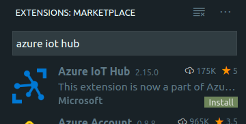

2. Click `Install`

3. Welcome screen for Azure IoT Hub Extension opens. Select `Select IoT Hub`

    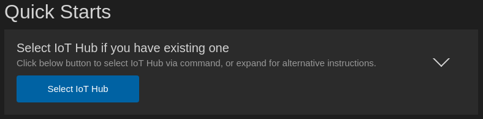
    * In case you don't see the Quick Starts you can select `-> Select IoT Hub` from Explorer sidebar

        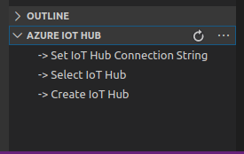

4. You will get a notification to sign in first, click `Sign in`

    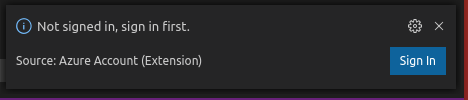

5. A browser will open with a login window. Login using your Azure credentials

    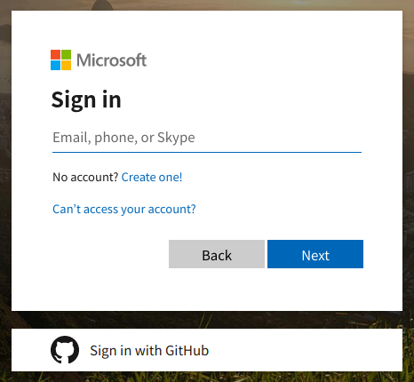

6. After succesful login you can close the browser.

    

7. You can now see available devices in the sidebar

    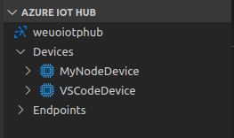

   
   
   

# Registering a device

A device can only be registered from terminal.

1. Run command
   
   `az iot hub device-identity create --hub-name {YourIoTHubName} --device-id {DeviceName}`

# Send IoT data
## Node.js
1. Navigate to simulator/send-iot-data folder
2. Copy Service connection string to local-settings.json (See Connections strings below)
3. Run `npm install`
4. Run `node index.js`

## VSCode extension
1. Open Azure IoT Hub from Explorer sidebar
2. Open Devices

    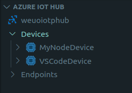

3. Right-click the device you want to listen
4. Select `Send D2C Message to Iot Hub`

    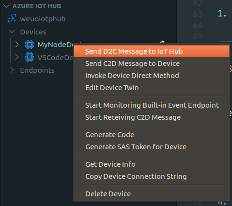
   
5. Enter how many messages and how long to wait between messages
6. Enter the data to send

    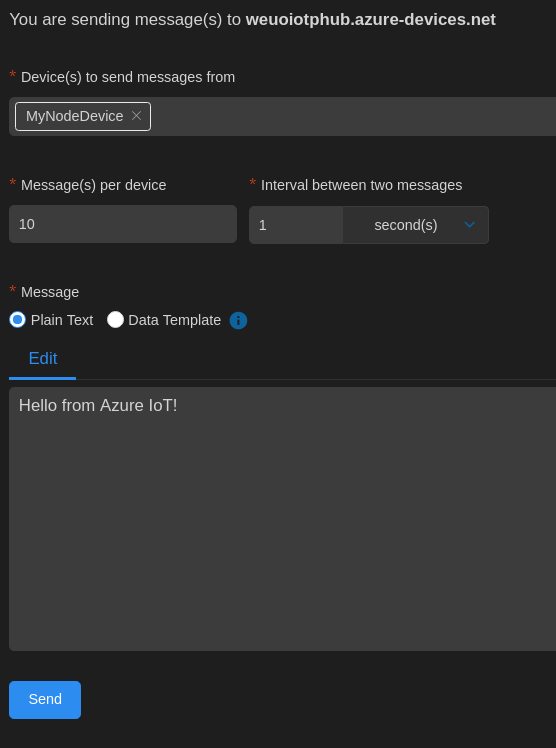

7. Click `Send`

# Receive IoT data
## Node.js
1. Navigate to simulator/send-iot-data folder
2. Copy Service connection string to local-settings.json (See Connections strings below)
3. Run `node index.js`

* To stop receiving IoT data, end the process by pressing Ctrl+C

## VSCode extension
1. Open Azure IoT Hub from Explorer sidebar
2. Open Devices

    

3. Right-click the device you want to listen
4. Select `Start Monitoring Built-in Event Endpoint`
   
    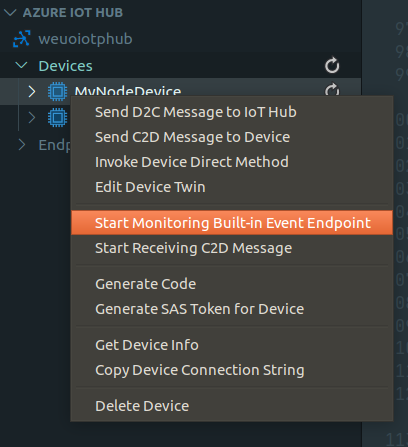

5. Output will open at the bottom of the screen where the data will be shown

    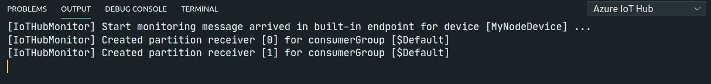

6. To stop monitoring, right click on the Output window and select `Stop Monitoring Built-in Event Endpoint`

    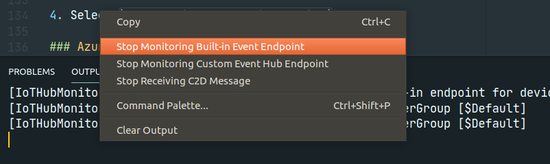

# Connection strings
## Device Connection string
### VSCode extension
1. Open Azure IoT Hub from Explorer sidebar
2. Open Devices

    

3. Right-click the device you want to listen

    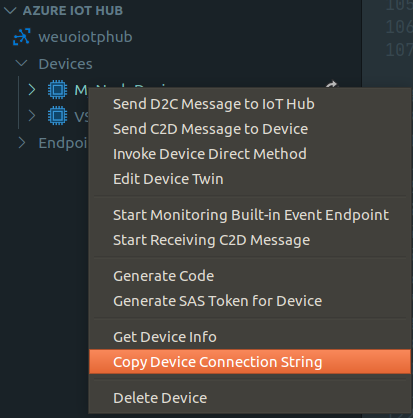

4. Select `Copy Device Connection String`

### Azure CLI
1. Run command

    `az iot hub device-identity show-connection-string --hub-name {YourIoTHubName} --device-id {DeviceName} --output table`

2. Connection string looks like:

   `HostName={YourIoTHubName}.azure-devices.net;DeviceId={DeviceName};SharedAccessKey={YourSharedAccessKey}`

## Service Connection string
### VSCode extension
1. Open Azure IoT Hub from Explorer sidebar
2. Click the 3 dots next to Azure Iot Hub `...`
   
    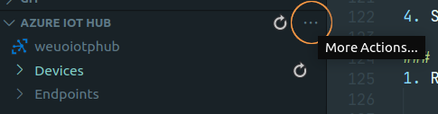

3. Select `Copy IoT Hub Connection String`
   
### Azure CLI

1. Run command

    `az iot hub show-connection-string --name {YourIoTHubName} --policy-name service --output table`

2. Service connection string looks like:

   `HostName={YourIoTHubName}.azure-devices.net;SharedAccessKeyName=service;SharedAccessKey={YourSharedAccessKey}`